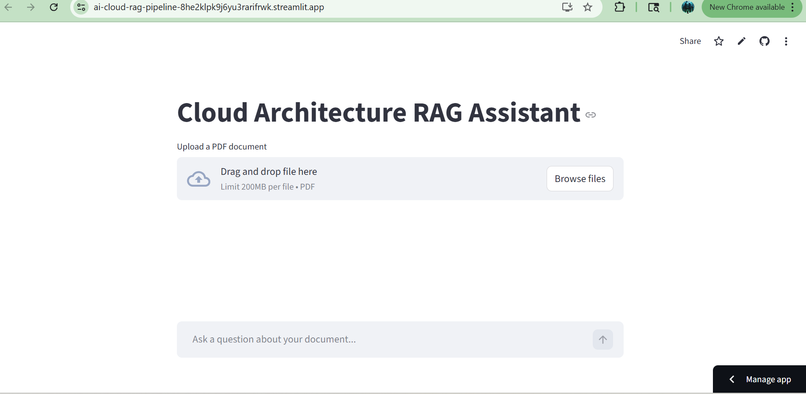

# ☁️ Cloud Architecture RAG Assistant

🔗 **Live App:**  
https://ai-cloud-rag-pipeline-8he2klpk9j6yu3rarifrwk.streamlit.app/

---

## 🚀 Overview

Cloud Architecture RAG Assistant is an end-to-end Retrieval-Augmented Generation (RAG) system built with Python, OpenAI embeddings, FAISS vector search, and Streamlit.

The application allows users to:

- Ask cloud architecture questions
- Upload PDF documents
- Retrieve semantically relevant context
- Generate accurate answers using an LLM
- Interact through a clean chat-style interface

This project demonstrates production-style AI system design using modular architecture and real vector search.

---

## 📸 Application Preview



---

## 🧠 How It Works

1. **Document Ingestion**
   - Upload PDF
   - Extract text
   - Chunk content into smaller segments

2. **Embedding Generation**
   - Convert chunks into vector embeddings using OpenAI

3. **Vector Storage**
   - Store embeddings in FAISS index

4. **Query Processing**
   - Convert user question into embedding
   - Perform similarity search in FAISS

5. **Answer Generation**
   - Pass retrieved context to GPT model
   - Generate final response grounded in retrieved content

---

## 🏗 Architecture Structure
AI-cloud-Rag-pipeline/
│
├── app.py # Streamlit frontend
├── requirements.txt
├── README.md
│
├── api/
├── ingestion/
├── embeddings/
├── processing/
├── rag/
└── data/

---

## 🛠 Tech Stack

- Python
- OpenAI API
- FAISS
- Streamlit
- NumPy
- PyPDF2
- Docker (optional)
- AWS deployment (optional)

---

## 💡 Features

- Semantic document retrieval
- Vector similarity search
- Chat-style interface
- PDF upload support
- Automatic FAISS index creation
- Streamlit Cloud deployment
- Modular production-ready structure

---

## ⚙️ Local Setup

### 1. Clone the repository

```bash
git clone https://github.com/harshitakoppaka/AI-cloud-Rag-pipeline.git
cd AI-cloud-Rag-pipeline
